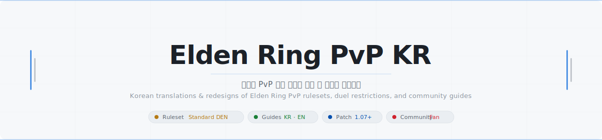

 

---

> [!NOTE]
> **Standard DEN Rules**은 일반 결투 및 래더에서 사용하는 기본 규정입니다.
> **Tournament Ruleset**은 토너먼트 참가자를 위한 부록 규정입니다 (전회 3회 제한 등 추가 규칙 포함).
>
> **Standard DEN Rules** are the primary ruleset for everyday duels and ladder play.
> **Tournament Ruleset** is supplementary — only for organised tournaments (includes additional rules such as the 3 Ash usage limit).

---

## 🌐 Google Docs / 브라우저에서 바로 보기

<b>📌 Standard DEN Rules — 일반 결투 · 래더</b>

 

| 문서 | Document | 링크 |
|------|----------|:----:|
| 결투 제한 규정 한국어판 | Standard DEN Restrictions (KR) | [🔗 Open](https://docs.google.com/document/d/19nzIk1BM0pPc-0tOQ-MzUqjdrQlJVL3PU0Qz2pvPh5s/edit?tab=t.0) |
| 결투 제한 규정 영문판 | Standard DEN Restrictions (EN) | [🔗 Open](https://docs.google.com/document/d/1kpKsYj8lQo7KkaKLnMWRCb6JPuC8Y0_M5h7lkdKNgmU/edit?tab=t.0) |

<b>📋 Tournament Ruleset — 토너먼트 전용 부록</b>

 

| 문서 | Document | 링크 |
|------|----------|:----:|
| 토너먼트 룰셋 설명 한국어판 | Tourney Ruleset Explanation (KR) | [🔗 Open](https://docs.google.com/document/d/1a46GJV2etOHvO8mcXmtXAXa9B8tTml80b4XhBU_x-08/edit?tab=t.0) |
| 토너먼트 룰셋 설명 영문판 | Tourney Ruleset Explanation (EN) | [🔗 Open](https://docs.google.com/document/d/1-ZBznyPk0yW4e7E1Ueo_tBkhQXjJWitsOPEPwASTRKk/edit?tab=t.0) |

<b>🎮 Guides — 가이드</b>

 

| 문서 | Document | 링크 |
|------|----------|:----:|
| 노만 트윈블레이드 가이드 한국어판 | Nohman TB Guide (KR) | [🔗 Open](https://docs.google.com/document/d/15EpQ8omEbPYKScOr4E2D9S2l6-G0BCyGJPKtdIN1a9I/edit?tab=t.0) |
| 노만 트윈블레이드 가이드 영문판 | Nohman TB Guide (EN) | [🔗 Open](https://docs.google.com/document/d/1gBohQpaa6Vvch9JIO-WneAlsyONmE64UKFV9eBk4DeI/edit?tab=t.0) |

---

## 📂 파일 목록 / File List

### 📁 `ruleset/`

<b>Standard DEN Rules / 일반 결투 · 래더 규정</b>

 

| 파일 | 설명 / Description |
|------|-------------------|
| [📄 Standard_DEN_Restrictions_KR.md](./ruleset/Standard_DEN_Restrictions_KR.md) | Standard DEN 결투 제한 규정 한국어판 |
| [📄 Standard_DEN_Restrictions_EN.md](./ruleset/Standard_DEN_Restrictions_EN.md) | Standard DEN Duel Restrictions (English) |
| [📄 Duel_Restrictions_KR.md](./ruleset/Duel_Restrictions_KR.md) | 결투 제한 규정 한국어 번역본 *(by sin)* |

<b>Tournament Ruleset / 토너먼트 전용 부록</b>

 

| 파일 | 설명 / Description |
|------|-------------------|
| [📄 Tourney_Ruleset_KR.md](./ruleset/Tourney_Ruleset_KR.md) | 토너먼트 룰셋 설명 한국어판 |
| [📄 Tourney_Ruleset_EN.md](./ruleset/Tourney_Ruleset_EN.md) | Tournament Ruleset Explanation (English) |
| [📜 Ruleset_Explanation_Document.pdf](./ruleset/Ruleset_Explanation_Document.pdf) | Original English PDF *(by crowned_pvp)* |

---

### 📁 `guides/`

<b>Community Guides / 커뮤니티 가이드</b>

 

| 파일 | 설명 / Description |
|------|-------------------|
| [📄 Nohman_TB_Guide_KR.md](./guides/Nohman_TB_Guide_KR.md) | 노만 트윈블레이드 가이드 한국어판 |
| [📄 Nohman_TB_Guide_EN.md](./guides/Nohman_TB_Guide_EN.md) | Nohman Twinblade Guide (English) |
| [📄 Colossal_Greatsword_Guide_KR.md](./guides/Colossal_Greatsword_Guide_KR.md) | 특대검 통합 가이드 한국어판 *(by sin, 𝑄𝑅𝑄)* |
| [📄 Colossal_Greatsword_Guide_EN.md](./guides/Colossal_Greatsword_Guide_EN.md) | Colossal Greatsword Guide (English) *(by sin, 𝑄𝑅𝑄)* |

<b>Weapon Guides by eisenwave</b>

 

| 파일 | 설명 / Description |
|------|-------------------|
| [📄 Straight_Sword_Guide_EN.md](./guides/Straight_Sword_Guide_EN.md) | Straight Sword PvP Guide (English) |
| [📄 Straight_Sword_Guide_KR.md](./guides/Straight_Sword_Guide_KR.md) | 직검 PvP 가이드 한국어판 |
| [📄 Halberd_Guide_EN.md](./guides/Halberd_Guide_EN.md) | Halberd PvP Guide (English) |
| [📄 Halberd_Guide_KR.md](./guides/Halberd_Guide_KR.md) | 미늘창 PvP 가이드 한국어판 |
| [📄 Katana_Guide_EN.md](./guides/Katana_Guide_EN.md) | Katana PvP Guide (English) |
| [📄 Katana_Guide_KR.md](./guides/Katana_Guide_KR.md) | 카타나 PvP 가이드 한국어판 |

---

### 📁 `info/`

<b>Reference & Tools / 참고 자료 및 툴</b>

 

| 파일 | 설명 / Description |
|------|-------------------|
| [📄 PvP_Resources_KR.md](./info/PvP_Resources_KR.md) | PvP 참고 자료 및 툴 모음 *(by Raven11)* |
| [📄 PvP_Resources_EN.md](./info/PvP_Resources_EN.md) | PvP Resources & Tools *(by Raven11)* |
| [📄 PvP_Lexicon_KR.md](./info/PvP_Lexicon_KR.md) | PvP 용어 사전 한국어판 *(by DEN competitive community)* |
| [📄 PvP_Lexicon_EN.md](./info/PvP_Lexicon_EN.md) | PvP Terminology Lexicon *(by DEN competitive community)* |
| [📜 Elden_Ring_PvP_Lexicon.pdf](./info/Elden_Ring_PvP_Lexicon.pdf) | Original Lexicon PDF |
| [📝 Elden_Ring_PvP_Lexicon.docx](./info/Elden_Ring_PvP_Lexicon.docx) | Original Lexicon DOCX |
| [📄 True_Combos_EN.md](./info/True_Combos_EN.md) | True Combo Reference *(by Halvard / Mugen)* |
| [📄 True_Combos_KR.md](./info/True_Combos_KR.md) | 트루콤보 레퍼런스 한국어판 *(by Halvard / Mugen)* |
| [📄 Stat_Analysis_KR.md](./info/Stat_Analysis_KR.md) | PvP 스탯 효율 분석 한국어판 *(원문: Drake Ravenwolf / PvP 분석: sin)* |
| [📄 Stat_Analysis_EN.md](./info/Stat_Analysis_EN.md) | PvP Stat Efficiency Analysis *(by Drake Ravenwolf / PvP analysis: sin)* |

---

## ⚠️ 저작권 / Copyright

> **원문의 모든 저작권은 각 원문 작성자에게 있습니다.**
> All intellectual property belongs to their respective original authors.
> This is a non-commercial fan translation project for accessibility purposes only.

| 콘텐츠 / Content | 원작자 / Original Author |
|-----------------|-------------------------|
| 룰셋 · 결투 제한 규정 / Ruleset & Duel Restrictions | crowned_pvp, DEN Rules Committee and Competitive Community |
| 트윈블레이드 가이드 / Twinblade Guide | Nohman |
| 특대검 가이드 / Colossal Greatsword Guide | sin, 𝑄𝑅𝑄 *(Feedback: Darcy)* |
| 직검 · 미늘창 · 카타나 가이드 / Straight Sword · Halberd · Katana Guide | eisenwave |
| PvP 참고 자료 / PvP Resources | Raven11 |
| PvP 용어 사전 / PvP Lexicon | DEN competitive community |
| 트루콤보 레퍼런스 / True Combo Reference | Halvard (Mugen) |
| 스탯 분석 / Stat Analysis | Drake Ravenwolf *(PvP analysis: sin)* |

---

## 👥 기여자 / Contributors

| 역할 / Role | 이름 / Name |
|-------------|-------------|
| 리디자인 / Redesign | Crong |
| 한국어 번역 / Korean Translation | sin |
| 협업 / Collaborators | Darcy, Pouya, 𝑄𝑅𝑄 |
| 피드백 / Feedback | LED, Ornstein, Emperor of Flames, Cielo |

---

## 💬 피드백 / Feedback

룰셋 내용에 대한 의견은 원문 커뮤니티 채널을 통해 전달해 주세요.
번역 및 리디자인에 대한 수정 제안은 이 레포지토리의 **Issue**를 통해 남겨주시면 감사하겠습니다.

For ruleset suggestions, please reach out through the original community channel.
For translation or formatting corrections, feel free to open an **Issue** on this repository.

 

*Made with ❤️ for the Elden Ring PvP community*

